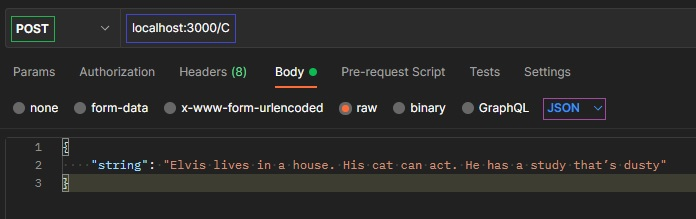
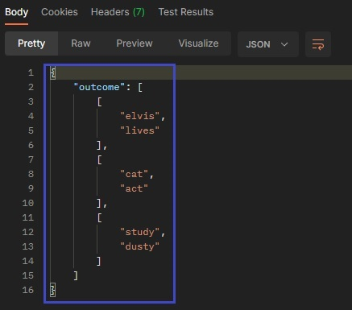

# Anagrams API
## Assignment for Verve Ventures

The task is to make an API that identifies anagrams between individual words and sentences. The different server functionalities will be exposed through three endpoints A, B and C.

## Local execution
* To run the script locally you must have [Node.js](https://nodejs.org/it/download/) and the [npm](https://docs.npmjs.com/downloading-and-installing-node-js-and-npm) package manager installed.

Just go to the root folder of the project with the terminal and run the following command :

`node ./main.js`

Now the server is listening on port `3000` of the `localhost`.
* In case you use the web application through *heroku* (at `anagramsapi.herokuapp.com`), then their port will be used.

## Test with Postman
When opening Postman, we open a new table and select **POST** as the HTTP request.

We enter the address of the web application, which must be one of :
* `anagramsapi.herokuapp.com`
* `localhost:3000`

Followed by a slash `/` with the desired endpoint between *A*, *B* and *C*.

In this case we consider the *C* endpoint, select the table "*Body*" and use the "*raw*" format to compile the request (with *JSON* formatting). Once the request is filled out, it is sent with the "SEND" button.



If the address entered is valid and the server is working, then we will receive a response containing the result or error. This will be displayed below the form for filling out the request, in a small window of equal size.



Also in the same response window you can see some relevant technical details such as the response code, response time, and message size.


### POST request examples
#### Endpoint A
For the POST request :
```json
{
    "string1": "Elvis",
    "string2": "lives"
}
```
The outcome should be :
```json
{
    "outcome": true
}
```
#### Endpoint B
For the POST request :
```json
{
    "str1": "elvis",
    "str2": "Elvis lives in a house"
}
```
The outcome should be :
```json
{
    "outcome": [
        "elvis",
        "lives"
    ]
}
```
#### Endpoint C
For the POST request :
```json
{
    "string": "Elvis silve lives without veils in a house with Ash. His cat can act. He has a study that’s dusty"
}
```
The outcome should be :
```json
{
    "outcome": [
        [
            "elvis",
            "silve",
            "lives",
            "veils"
        ],
        [
            "ash",
            "has"
        ],
        [
            "cat",
            "act"
        ],
        [
            "study",
            "dusty"
        ]
    ]
}
```
